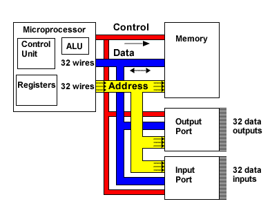

## CPU 总线
分开来说，微处理器，存储器和输入/输出端是有趣的组件，但它们无法做任何有用的事情。组合起来，如果他们可以彼此通信，他们可以形成一个完整的系统。这种通信通过一组信号线束（称为总线）将系统在一起。（In isolation, the microprocessor, the memory and the input/output ports are interesting components, but they cannot do anything useful. In combination, they can form a complete system if they can communicate with each other. This communication is accomplished over bundles of signal wires (known as buses) that connect the parts of the system together.）

任何处理器系统中通常都有三种类型的总线：
+ 地址总线(address bus)：这决定了处理器从中读取数据或将数据写入的内存中的位置。(this determines the location in memory that the processor will read data from or write data to.)
+ 数据总线(data bus)：它包含已从内存位置读取或将被写入内存位置的内容。(this contains the contents that have been read from the memory location or are to be written into the memory location.)
+ 控制总线(control bus)：它管理组件之间的信息流，指示操作是读取还是写入  并确保在合适的时间进行操作。(this manages the information flow between components indicating whether the operation is a read or a write and ensuring that the operation happens at the right time.)

1. [Data bus, address bus, control bus]

[Data bus, address bus, control bus]: http://www-mdp.eng.cam.ac.uk/web/library/enginfo/mdp_micro/lecture1/lecture1-3-1.html
