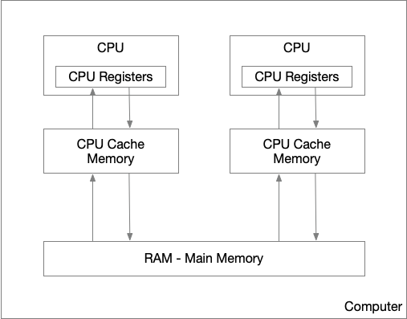
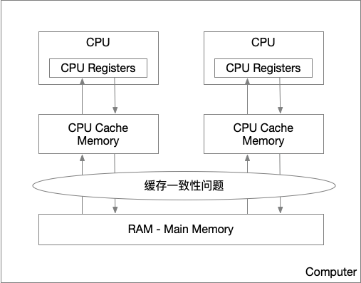
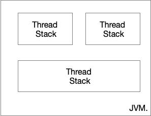
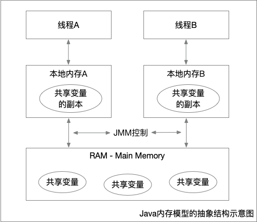
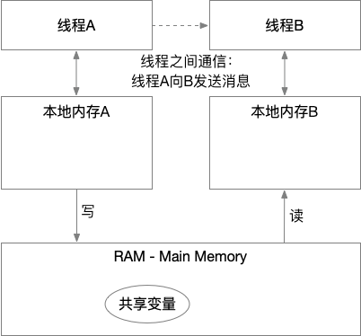

这里汇总一些，Java并发编程相关的知识，推荐一些公认的写的和好的书籍。**提及的知识并非原创、均附有出处链接，详情可以点击进入**

## Java 内存模型
Java内存模型(Java Mommory Model， JMM)描述了Java编程语言中的线程如何通过内存进行交互。(The Java memory model describes how threads in the Java programming language interact through memory.) [jmm from wikipedia]

理解Java内存模型，对于编写表现行为正确的并发行为很重要。Java内存模型指定了如何与何时可以看到由其它线程修改过后的共享变量的值，以及，在必要时，如何同步的访问共享变量。（It is very important to understand the Java memory model if you want to design correctly behaving concurrent programs. The Java memory model specifies how and when different threads can see values written to shared variables by other threads, and how to synchronize access to shared variables when necessary.）[Java Memory Model, Jakob Jenkov]

> JMM 屏蔽了各种硬件和操作系统的内容访问差异，让Java程序在各种平台下达到了一致的并发效果。
<!--more-->

推荐这本书 [深入理解Java内存模型, 程晓明][] 对并发讲解的通熟易懂，整体的了解下JMM。下面是摘自开篇的一段概述：

> 在并发编程中，我们需要处理两个关键问题：线程之间如何通信及线程之间如何同步（这里的线程是指并发执行的活动实体）。通信是指线程之间以何种机制来交换信息。在命令式编程中，线程之间的通信机制有两种：共享内存和消息传递。

> 在共享内存的并发模型里，线程之间共享程序的公共状态，线程之间通过写-读内存中的公共状态来隐式进行通信。在消息传递的并发模型里，线程之间没有公共状态，线程之间必须通过明确的发送消息来显式进行通信。

> 同步是指程序用于控制不同线程之间操作发生相对顺序的机制。在共享内存并发模型里，同步是显式进行的。程序员必须显式指定某个方法或某段代码需要在线程之间互斥执行。在消息传递的并发模型里，由于消息的发送必须在消息的接收之前，因此同步是隐式进行的。

> Java 的并发采用的是共享内存模型，Java 线程之间的通信总是隐式进行，整个通信过程对程序员完全透明。如果编写多线程程序的 Java 程序员不理解隐式进行的线程之间通信的工作机制，很可能会遇到各种奇怪的内存可见性问题。

深入链接JMM之前，简单了解下硬件内存架构，对于理解JMM有很大的帮助，如一些JMM设计的来由，以及JMM如何与它进行交互等。
### 计算机硬件内存架构
下面是一个简化的现代计算机硬件架构内存模型图[Java Memory Model, Jakob Jenkov]

多CPU，现代计算机通常由2个或更多个CPU，每个CPU可以有多个核，这意味着，并行的运行多个线程时可能的。

CPU寄存器，每个CPU都有一些列的寄存器——CPU内存的基础, 并且CPU对于寄存器的访问速度远大于对‘主存’(Main Memory, RAM)的访问。

高速缓存，每个CPU都有一个CPU缓存层(CPU cache memory Layer)。CPU对于CPU混存的访问速度介于‘寄存器’和’主存’之前，比寄存器慢，但是快于‘主存’。由于计算机的存储设备与处理器的运算速度之间有着几个数量级的差距，所以现代计算机系统都不得不加入一层读写速度尽可能接近处理器运算速度的高速缓存（Cache）来作为内存与处理器之间的缓冲：将运算需要使用到的数据复制到缓存中，让运算能快速进行，当运算结束后再从缓存同步回内存之中，这样处理器就无须等待缓慢的内存读写了

内存：一个计算机还包含一个主存。所有的CPU都可以访问主存。主存通常比CPU中的缓存大得多。

通常情况下，当一个CPU需要读取主存时，它会将主存的部分读到CPU缓存中。最后，它可能将缓存中的部分内容读到它的内部寄存器中，然后在寄存器中执行操作。当CPU需要将结果写回到主存中去时，它会将内部寄存器的值刷新到缓存中，然后在某个时间点将值刷新回主存。

#### 硬件结构产生的一些问题[Java内存模型（JMM）总结, EnjoyMoving]
在多处理器系统中，每个处理器都有自己的高速缓存，而它们又共享同一主内存（MainMemory）。基于高速缓存的存储交互很好地解决了处理器与内存的速度矛盾，但是也引入了新的问题：缓存一致性（CacheCoherence）
##### 缓存一致性问题
当多个处理器的运算任务都涉及同一块主内存区域时，将可能导致各自的缓存数据不一致的情况，如果真的发生这种情况，那同步回到主内存时以谁的缓存数据为准呢？为了解决一致性的问题，需要各个处理器访问缓存时都遵循一些协议，在读写时要根据协议来进行操作，这类协议有MSI、MESI（IllinoisProtocol）、MOSI、Synapse、Firefly及DragonProtocol，等等：

##### 指令重排序问题
为了使得处理器内部的运算单元能尽量被充分利用，处理器可能会对输入代码进行乱序执行（Out-Of-Order Execution）优化，处理器会在计算之后将乱序执行的结果重组，保证该结果与顺序执行的结果是一致的，但并不保证程序中各个语句计算的先后顺序与输入代码中的顺序一致。因此，如果存在一个计算任务依赖另一个计算任务的中间结果，那么其顺序性并不能靠代码的先后顺序来保证。与处理器的乱序执行优化类似，Java虚拟机的即时编译器中也有类似的指令重排序（Instruction Reorder）优化

### Java内存结构[Java Memory Model, Jakob Jenkov]
Java内部内存模型分为：线程栈(threads Stack)和堆(Heap).

#### Java内存结构与硬件内存架构之间存在差异
硬件内存架构没有区分线程栈和堆。对于硬件，所有的线程栈和堆都分布在主内存中。部分线程栈和堆可能有时候会出现在CPU缓存中和CPU内部的寄存器中。如下图所示：

### Java内存模型的抽象[深入理解Java内存模型, 程晓明]

在 java 中，所有实例域、静态域和数组元素存储在堆内存中，堆内存在线程之间共享（本文使用“共享变量”这个术语代指实例域，静态域和数组元素）。局部变量（Local variables），方法定义参数（java 语言规范称之为 formal method parameters）和异常处理器参数（exception handler parameters）不会在线程之间共享，它们不会有内存可见性问题，也不受内存模型的影响。

  +    线程之间的共享变量存储在主内存（main memory）中，
  +    每个线程都有一个私有的本地内存（local memory），本地内存中存储了该线程以读/写共享变量的副本。
  +    本地内存是JMM的一个抽象概念，并不真实存在。它涵盖了缓存，写缓冲区，寄存器以及其他的硬件和编译器优化。
  +    线程之前的通信有Java内存模型控制。JMM 决定一个线程对共享变量的写入何时对另一个线程可见。

### 主内存与工作内存（本地内存）的交互协议
关于主内存与工作内存之间的具体交互协议，即一个变量如何从主内存拷贝到工作内存、如何从工作内存同步到主内存之间的实现细节，Java内存模型定义了以下八种操作来完成：

  +    lock（锁定）：作用于主内存的变量，把一个变量标识为一条线程独占状态。
  +    unlock（解锁）：作用于主内存变量，把一个处于锁定状态的变量释放出来，释放后的变量才可以被其他线程锁定。
  +    read（读取）：作用于主内存变量，把一个变量值从主内存传输到线程的工作内存中，以便随后的load动作使用
  +    load（载入）：作用于工作内存的变量，它把read操作从主内存中得到的变量值放入工作内存的变量副本中。
  +    use（使用）：作用于工作内存的变量，把工作内存中的一个变量值传递给执行引擎，每当虚拟机遇到一个需要使用变量的值的字节码指令时将会执行这个操作。
  +    assign（赋值）：作用于工作内存的变量，它把一个从执行引擎接收到的值赋值给工作内存的变量，每当虚拟机遇到一个给变量赋值的字节码指令时执行这个操作。
  +    store（存储）：作用于工作内存的变量，把工作内存中的一个变量的值传送到主内存中，以便随后的write的操作。
  +    write（写入）：作用于主内存的变量，它把store操作从工作内存中一个变量的值传送到主内存的变量中。

Java内存模型还规定了在执行上述八种基本操作时，必须满足如下规则：

  +    如果要把一个变量从主内存中复制到工作内存，就需要按顺寻地执行read和load操作， 如果把变量从工作内存中同步回主内存中，就要按顺序地执行store和write操作。但Java内存模型只要求上述操作必须按顺序执行，而没有保证必须是连续执行。
  +    不允许read和load、store和write操作之一单独出现
  +    不允许一个线程丢弃它的最近assign的操作，即变量在工作内存中改变了之后必须同步到主内存中。
  +    不允许一个线程无原因地（没有发生过任何assign操作）把数据从工作内存同步回主内存中。
  +    一个新的变量只能在主内存中诞生，不允许在工作内存中直接使用一个未被初始化（load或assign）的变量。即就是对一个变量实施use和store操作之前，必须先执行过了assign和load操作。
  +    一个变量在同一时刻只允许一条线程对其进行lock操作，但lock操作可以被同一条线程重复执行多次，多次执行lock后，只有执行相同次数的unlock操作，变量才会被解锁。lock和unlock必须成对出现
  +    如果对一个变量执行lock操作，将会清空工作内存中此变量的值，在执行引擎使用这个变量前需要重新执行load或assign操作初始化变量的值
  +    如果一个变量事先没有被lock操作锁定，则不允许对它执行unlock操作；也不允许去unlock一个被其他线程锁定的变量。
  +    对一个变量执行unlock操作之前，必须先把此变量同步到主内存中（执行store和write操作）。

### 重排序[深入理解Java内存模型, 程晓明]
在执行程序时为了提高性能，编译器和处理器常常会对指令做重排序。重排序分三种类型：
  1. 编译器优化的重排序。编译器在不改变单线程程序语义的前提下，可以重新安排语句的执行顺序。
  2. 指令级并行的重排序。现代处理器采用了指令级并行技术（Instruction-Level Parallelism， ILP）来将多条指令重叠执行。如果不存在数据依赖性，处理器可以改变语句对应机器指令的执行顺序。
  3. 内存系统的重排序。由于处理器使用缓存和读 / 写缓冲区，这使得加载和存储操作看上去可能是在乱序执行。

从 java 源代码到最终实际执行的指令序列，会分别经历下面三种重排序：

上述的 1 属于编译器重排序，2 和 3 属于处理器重排序。这些重排序都可能会导致多线程程序出现内存可见性问题。对于编译器，JMM 的编译器重排序规则会禁止特定类型的编译器重排序（不是所有的编译器重排序都要禁止）。对于处理器重排序，JMM 的处理器重排序规则会要求 java 编译器在生成指令序列时，插入特定类型的内存屏障（memory barriers，intel 称之为 memory fence）指令，通过内存屏障指令来禁止特定类型的处理器重排序（不是所有的处理器重排序都要禁止）。

**JMM 属于语言级的内存模型，它确保在不同的编译器和不同的处理器平台之上，通过禁止特定类型的编译器重排序和处理器重排序，为程序员提供一致的内存可见性保证。**

#### 处理器重排序[深入理解Java内存模型, 程晓明]
现代的处理器使用写缓冲区来临时保存向内存写入的数据。写缓冲区可以保证指令流水线持续运行，它可以避免由于处理器停顿下来等待向内存写入数据而产生的延迟。同时，通过以批处理的方式刷新写缓冲区，以及合并写缓冲区中对同一内存地址的多次写，可以减少对内存总线的占用。虽然写缓冲区有这么多好处，但每个处理器上的写缓冲区，仅仅对它所在的处理器可见。这个特性会对内存操作的执行顺序产生重要的影响：处理器对内存的读/写操作的执行顺序，不一定与内存实际发生的读/写操作顺序一致！
#### 内存屏障指令

| 屏障类型  |  指令示例 | 说明 |
|---|---|---|
| LoadLoad Barriers  | Load1; LoadLoad; Load2  | 确保 Load1 数据的装载，之前于 Load2 及所有后续装载指令的装载。|
| StoreStore Barriers	| Store1; StoreStore; Store2	| 确保 Store1 数据对其他处理器可见（刷新到内存），之前于 Store2 及所有后续存储指令的存储。|
| LoadStore Barriers | Load1; LoadStore; Store2 | 确保 Load1 数据装载，之前于 Store2 及所有后续的存储指令刷新到内存。|
| StoreLoad Barriers | Store1; StoreLoad; Load2 |	确保 Store1 数据对其他处理器变得可见（指刷新到内存），之前于 Load2 及所有后续装载指令的装载。 StoreLoad Barriers 会使该屏障之前的所有内存访问指令（存储和装载指令）完成之后，才执行该屏障之后的内存访问指令。|

> StoreLoad Barriers 是一个“全能型”的屏障，它同时具有其他三个屏障的效果。现代的多处理器大都支持该屏障（其他类型的屏障不一定被所有处理器支持）。执行该屏障开销会很昂贵，因为当前处理器通常要把写缓冲区中的数据全部刷新到内存中（buffer fully flush）。

#### happens-before
+  程序顺序规则：一个线程中的每个操作，happens- before 于该线程中的任意后续操作。
+ 监视器锁规则：对一个监视器锁的解锁，happens- before 于随后对这个监视器锁的加锁。
+ volatile 变量规则：对一个 volatile 域的写，happens- before 于任意后续对这个 volatile 域的读。
+ 传递性：如果 A happens- before B，且 B happens- before C，那么 A happens- before C。

### 数据依赖性
如果两个操作访问同一个变量，且这两个操作中有一个为写操作，此时这两个操作之间就存在数据依赖性。数据依赖分为下列3种类型：

| 名称  | 代码示例 |
|---|---|
| 写后读  | a = 1;   b=a; |
| 写后写  | a = 1;   a=2; |
| 读后写  | a = b;   b=1; |

上面3种情况，只要重排序两个操作的执行顺序，程序的执行结果就会被改变。

编译器和处理器可能会对操作做重排序。编译器和处理器在重排序时，会遵守数据依赖性，编译器和处理器不会改变存在数据依赖关系的两个操作的执行顺序。

这里所说的数据依赖性仅针对单个处理器中执行的指令序列和单个线程中执行的操作，不同处理器之间和不同线程之间的数据依赖性不被编译器和处理器考虑。

#### as-if-serial语义
as-if-serial语义的意思是：不管怎么重排序（编译器和处理器为了提高并行度），（单线程）程序的执行结果不能被改变。
#### 数据竞争
+  在一个线程池中写一个变量
+  在另外一个线程中读同一个变量
+  而且写和读没有同步来排序.
#### JMM顺序一致性保证
如果程序是正确同步的，程序的执行将具有顺序一致性（sequentially consistent）–即程序的执行结果与该程序在顺序一致性内存模型中的执行结果相同（马上我们将会看到，这对于程序员来说是一个极强的保证）。这里的同步是指广义上的同步，包括对常用同步原语（lock，volatile和final）的正确使用。
### 同步原语-volitile
当声明一个变量为volatile后，具备一下特性
+  可见性。对一个volatile变量的读，总是能看到（任意线程）对这个volatile变量的最后的写入。
+  原子性。对任意单个volatile变量的读/写具有原子性，但是类似volatile++的复合操作不具有原子性。
+  程序顺序规则和volatile规则组合后，提供的happens-before关系
#### volatile的内存语义

  

+ 当写一个volatile时，JMM会把该线程对应的本地内存中的共享变量刷新到主内存中。
+ 当读一个volatile时，JMM会把线程对应的本地内存设置为无效。从而是的被监视器保护的临界区代码必须要从主内存中读取共享变量。

#### volatile的内存语义的实现
为了实现volatile的内存语义，JMM会限制编译器重排序和处理器重排序。

|  操作 | 普通读/写  | volatile 读 | volatile 写 |
|---|---|---|---|
| 普通读/写 |    | | NO |
| volatile 读 | NO | NO | NO |
| volatile 写 | | NO  | NO |

+  当第二个操作是volatile写时，不管第一个操作是什么，都不能重排序。这个规则确保volatile写之前的操作不会被编译器重排序到volatile写之后。
+  当第一个操作是volatile读时，不管第二个操作是什么，都不能重排序。这个规则确保volatile读之后的操作不会被编译器重排序到volatile读之前。
+  当第一个操作是volatile写，第二个操作是volatile读时，不能重排序。

为了实现volatile的内存语义，编译器在生成字节码时，会在指令序列中插入内存屏障来禁止特定类型的处理器重排序。
+  在每个volatile写操作的前面插入一个 StoreStore屏障。防止上面的普通写和下面volatile的写重排序。
+  在每个volatile写操作的后面插入一个 StoreLoad屏障。防止上面的volatile的写和下面可能的volatile的读/写重排序。
+  在每个volatile读操作的后面插入一个 LoadLoad屏障。防止下面的普通读操作和上面volatile的读重排序。
+  在每个volatile写操作的后面插入一个 LoadStore屏障。防止下面的普通写操作和上面volatile的读重排序。

### 锁
锁是java并发编程中最重要的同步机制，
+  让临界区互斥执行
+  锁的释放的线程向获取同一个锁的线程发送消息。
+  程序顺序规则和监视器锁规则组合后，提供的happens-before关系
#### 锁释放和获取的内存语义

  

+ 当线程释放锁时，JMM会把该线程对应的本地内存中的共享变量刷新到主内存中。
+ 当线程获取锁时，JMM会把线程对应的本地内存设置为无效。从而是的被监视器保护的临界区代码必须要从主内存中读取共享变量。
#### 锁内存语义的实现
1. 利用volatile变量的写-读所具有的内存语义
2. 利用CAS所附带的volatile读和volatile写的内存语义。

#### 同步原语-final
编译器和处理对final域对重排序遵守两个规则
1. 在构造函数内对一个final域的写入，与随后把这个构造对象的引用赋值给一个引用变量，这个两个操作之间不能重排序。
2. 初次读一个包含final域的对象的引用，与随后初次读这个final域，这两个操作之间不能重排序。
##### 写final域的重排序规则
写final域的重排序规则禁止把final域的写重排序到构造函数之外。包含两方面：
1. JMM禁止编译器把final域的写重排序到构造函数之外。
2. 编译器会在final域的写之后，构造函数return之前，插入一个StoreStore屏障。禁止处理器把final域的写重排序到构造函数之外。
##### 读final域的重排序规则
在一个线程中，初次读对象引用与初次读该对象包含的final域，JMM禁止处理器重排序这两个操作。（注意，这个规则仅仅针对处理器）。处理器会在读final域操作的前面插入一个LoadLoad屏障。

##### 非阻塞算法 CAS
CAS 同时具有volatile读和volatile写读内存语义，底层原子化的方式取代锁.

### 参考引用
1. [Java Memory Model, Jakob Jenkov][]
2. [jmm from wikipedia][]
3. [深入理解Java内存模型, 程晓明][]
4. [正确使用 Volatile 变量](https://www.ibm.com/developerworks/cn/java/j-jtp06197.html)

[jmm from wikipedia]:https://en.wikipedia.org/wiki/Java_memory_model
[Java Memory Model, Jakob Jenkov]:http://tutorials.jenkov.com/java-concurrency/java-memory-model.html
[深入理解Java内存模型, 程晓明]:https://www.infoq.cn/article/java_memory_model
[Java内存模型（JMM）总结, EnjoyMoving]: https://zhuanlan.zhihu.com/p/29881777
